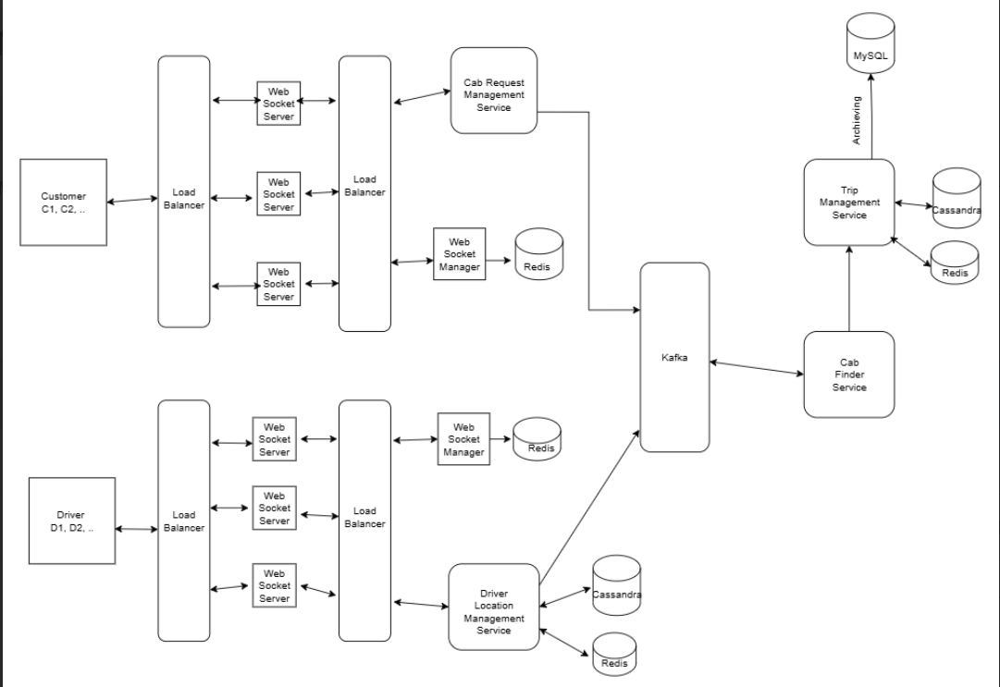

## 🔹 HLD Interview Scenario: Design a Ride-Sharing Application (e.g., Uber/Ola)

---

### 🧠 Step 1: Requirement Analysis

#### ✅ Functional Requirements:
* Rider, Driver Registration & Login - verify phone/ email
* Ride Booking - Ride Matching (assigning nearest driver on ride request), Fare estimation based on distance
* Ride cancellation (optional)
* Chat between rider & driver (optional)
* Ride Status Tracking (requested, ongoing, completed)
* Map integrations (optional)
* Payment Handling - Payment Method gateway, On paid, getting invoice (optional)
* Rating System (optional)
* Car-pooling (allowing different riders to accomodate in same ride) (optional)
* Notification (optional)

#### 🛠️ Non-Functional Requirements:
* Scalable - Millions of users, so should be able to handle high throughput (requests per second), and large datasets, while maintaining low latency (time to respond per request), write-heavy system
* High Availability
* Fault Tolerant
* Eventual Consistency
* Usability - Intutive, user-friendly interface for users to input data, and view results
* Extendability: Ability to support additional features in future
* Security and Privacy: Protection of user data, JWT/ OAuth Authentication, Authorization, and rate limiting.

List down all the requirements, then ask if require to include any other functionality?
Say, being aware of limited time, i start with main service i.e. Ride Booking.


### 🧠 Step 2: High Level Architecture Diagram:

#### Flow/ UML Diagram
> Client (Hit the API Gateway through UI) → Application Layer (Add location, see price, Book Ride, On ride accept (Start/End ride), Calculate fare) → Database (store userId, location, price)

### UseCase Diagram
> Rider → Requests Cab (Giving pickup, drop location, distance, fare calculated) → Finding nearest cab (Driver sees the request, if accepts) → ride starts → On ride finish, show in recent rides and payment

### HLD Diagram


**Drivers (d1, d2, d3)** interacts with different **websocket servers** using **load balancer**, and managed by **websocket manager**. Driver connections are then routed to the **'Driver Location Management Service'**, which maintains real-time driver stats (GPS co-ordinates, availability status) using **redis** (for faster in-memory cache) and asynchronously updates **cassandra database** (due to its ability to handle geographically distributed data with high scalability and availability).

**Customers (c1, c2, c3)** also interacts with different **websocket servers** using **load balancer**, and managed by **websocket manager**. Customer connections are then routed to **'Cab Request Management Service'**, which validates trip details (pickup, drop location, fare estimated based on distance), and publish request to **kafka** message queue.

**Kafka** feeds **'Cab Finder Service'** which identifies most suitable driver, by querying redis for real-time driver location. To optimize driver selection it may use **graph-based algorithm** (like Dijkstra) to find nearest available driver. Once driver accepts request, the **'Trip Management Service'** initializes and maintains ride state with GPS updates in **redis** and persist data in **Cassandra Database** for fast real-time lookups. On ride completion, a summary (pickup, drop, driver, customer, distance, fare, payment method) details are stored in **MySQL database** for its ACID properties, as historical trip data.


### 🧠 Step 3: API Design
**Customer**
```
POST /v1/bookings {pickup, drop, driver, customer, distance, fare, payment method}
GET  /v1/bookings/{id}
WS  /v1/stream  // booking & trip updates
```

**Driver**
```
POST /v1/driver/status {ONLINE|OFFLINE|BUSY}
POST /v1/driver/accept {bookingId}
WS /v1/driver/stream  // locationUpdates → server, offers (nearest rides) ← server
```


### 🧠 Step 4: Edge Cases
- no driver found
- multiple driver accepts the ride
- driver disconnect in mid of ride
- customer cancelled the ride in between, or when driver arriving to the location
- Fraud cases (like same person as customer and driver from different accounts)
- payment failure

