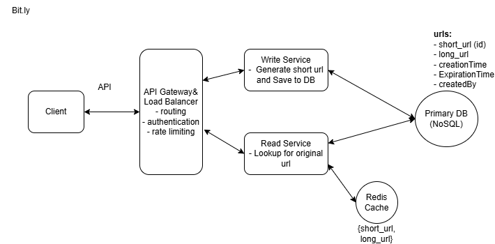
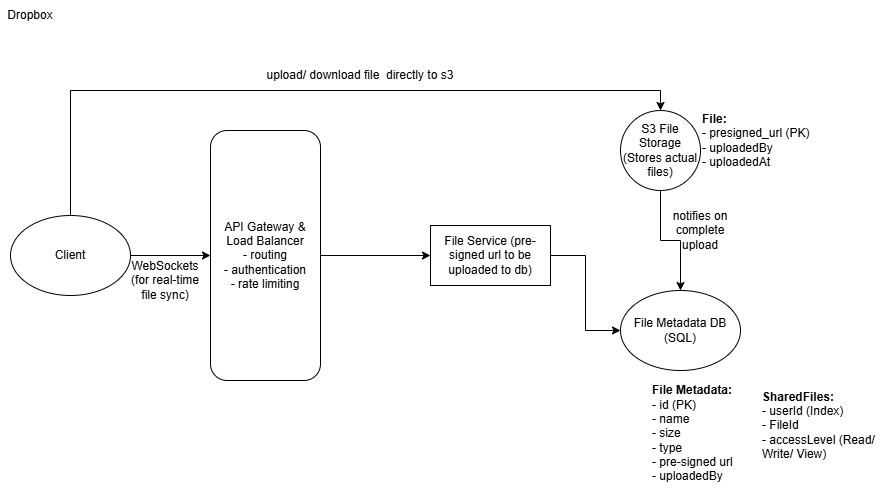
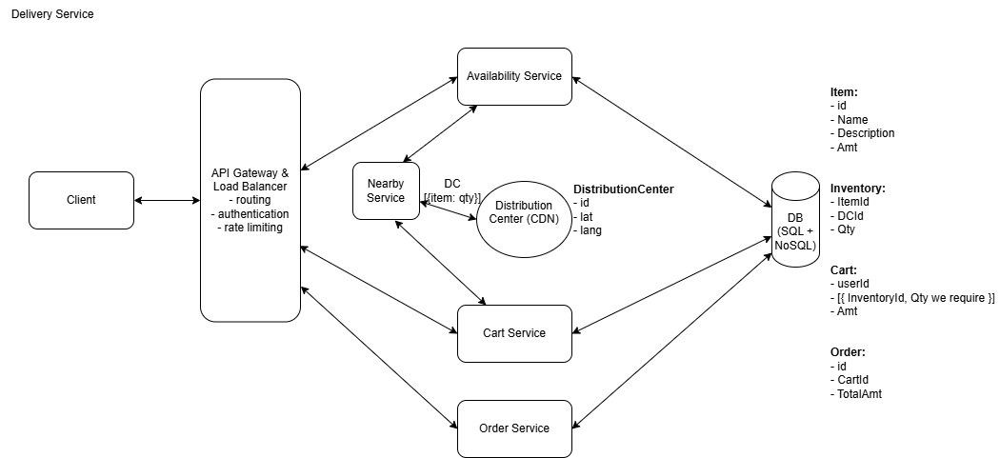
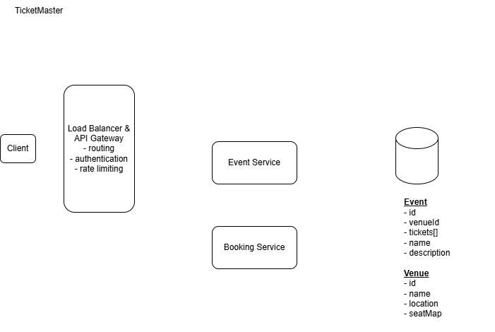

#### ✅ System Design Questions:
1. Design URL shortening system (Bit.ly)
2. Design file storage system (Dropbox)
3. Design Delivery Service (Blinkit - User side)
4. Design TicketMaster (like BookMyShow i.e. allow users to purchase tickets for diff events)
5. 

---

## 1. Design URL shortening system (Bit.ly)

#### Step 1: Requirement Analysis
Functional Requirements: Users should be able to:
- submit long url, shorten alias, expirationDate to get shorten url 
  - check if already exist otherwise create new
- user access long/ original url using shorten url

below the line:
- Notification, review , user profile (view all created shorten urls)

Non-Functional Requirements:
- high availability, eventual consistency
- read-heavy system

#### Step 2: Core Entities:
- User
- Original URL
- Shorten URL

#### Step 3: API/ System Interface:
- shorten a url
  ```
  POST /url
  Request Body:{
    "long_url": String,
    "custom_alias": String,
    "expiration_date": Timestamp
  }
  ->
  Response Body:{
    "short-url": String
  }
  ```

- Redirection to original url
  ```
  GET /short_url
  ->
  Response Body:{
    url: redirect to original long_url
  }
  ```

#### Step 4: DB Choice:
NoSQL as Access pattern is key based, read heavy and requires horizontal scaling.
```json
{
  "short_url (primary key)": "abc123",    
  "original_url": "https://…",
  "created_at": "2025-01-01T10:00:00Z",
  "expires_at": "2025-12-31T23:59:59Z",
  "created_by": "user123",
  "click_count": 1024
}
```

#### Step 5: High Level Design:

As system is read heavy, we can use caching for better performance.

---

## 2. Design file storage system (Dropbox)

#### Step 1: Requirement Analysis:
Functional Requirements: Users should be able to
- upload/ download/ share/ view/ edit file from any device

below the line:
- Notification, review, payments, user profile (view past uploads, etc)

Non-Functional Requirements: 
- Strong Consistency preferred over availability
- read-heavy system

#### Step 2: Core Entities:
- User
- File (actual content)
- FileMetadata (file name, size, type)

#### Step 3: API/ System Interface:
- upload 
  ```
  POST /files
  Request Body: {
    File,
    FileMetaData
  }
  -> 
  Response Body: {
    successMessage: String
  }
  ```

- download
  ```text
  GET /file/{fileId}
  ->
  Response Body: {
    file: url to download file,
    fileMetadata: json
  }
  ```

- share
  ```text
  POST /file/{fileId}/share
  Request Body: {
    users[]: ArrayList<Integer>
  }
  ->
  Response Body: {
  successMessage: String
  }
  ```

- edit
  ```text
  GET /file/{fileId}/changes
  {
    FileMetadata[]
  }
  ```

#### Step 5: DB Choice:
FileStorage for actual file content.
SQL for fileMetadata because of its ACID properties.

#### Step 4: High Level Design:

Uploading directly to storage server will reduce load on application server and improve performance.

---

## 3. Design E-Commerce Service (Blinkit/ Flipkart - User side)

#### Step 1: Requirement Analysis:
Functional Requirements: User should be able to:
- check availability of items by location
- add/ modify/ view cart 
- place order of items

below the line:
- assign driver, track delivery, view order status
- Notification, Payments, Review System, User Profile (view past orders, reorder, etc)

Non-Functional Requirements: 
- For platform High availability, eventual consistency
- For order management, strong consistency to avoid placing multiple orders for same item.
- read-heavy system

#### Step 2: Core Entities:
- User
- Item
- inventory (available items)
- order (placed items)
- distributed center (CDN) for location

#### Step 3: API/ System Interface: 
- get availability of items at given location
  ```
  GET /v1/availability?lat=LAT&long=LONG&page=2&size=10
  Response Body: {
    items: [{
      name: String,
      quantity: Integer,
      price: Double
    }]
  }
  ```

- cart management (add/ modify/ view cart)
  ```
  POST /v1/cart       // for add/ modify cart
  Request Body: {
    userId: USER_ID
    itemId: ITEM_ID
    quantity: QUANTITY
  }
  
  GET /v1/cart?userId=USER_ID   // for view cart
  ```

- place order
  ```text
  POST /v1/order
  Request Body: {
      userId: USER_ID,
      lat: Integer,
      long: Integer,
      items: {ITEM1, ITEM2, ITEM3,..}
  }
  ->
  Response Body: {
      orderId: ORDER_ID,
      order success/ failure
  }
  ```

#### Step 4: DB Choice:
SQL for order management (ACID properties required)
NoSQL for inventory management (read-heavy, horizontal scaling)

#### Step 5: High Level Design:
HLD:


If available in nearby Distributed Center (CDN) → add to cart (continuously checking availability) → place order from cart

---

## Design Food Delivery Service (Swiggy/ Zomato - User side)

* Search restaurants, place orders, real-time tracking
- Rest same as above E-Commerce Service.

---

## Design Cab booking Service (Uber/ rapido - User side)

#### Step 1: Requirement Analysis:
Functional Requirements: User should be able to:
- take pickup/ drop location, calculate fare based on distance
- assign driver based on nearest availability, ride status, real-time tracking

below the line:
- Notification, Rating System, Payments, User Profile (view past orders, reorder, etc)

Non-Functional Requirements: 
- high availability for entire user experience
- high consistency for ride booking to avoid multiple bookings for same driver
- write-heavy system 

#### Step 2: Core Entities:
- User (Rider, Driver)
- Ride (current ride details)
- Vehicle
- distributed center (CDN) for location

#### Step 3: API/ System Interface:
- calculate fare distance based on pickup
  ```
  POST /v1/fare
  Request Body: {
    pickupLocation: {LAT, LONG},
    dropLocation: {LAT, LONG},
    city: String (for CDN)
  }
  ->
  Response Body: {
    distance: Double,
    fare: Double
  }
  ```

- book a ride based on distance and availability of drivers
  ```
  POST /v1/book
  Request Body: {
    userId: USER_ID,
    pickupLocation: {LAT, LONG},
    dropLocation: {LAT, LONG}
  }
  ->
  Response Body: {
    rideId: RIDE_ID,
    status: ride success/ failure
  }
  ```

- real-time tracking of ride status and driver location - Websocket API for real-time updates
  ```
  GET /v1/track/{rideId}
  ->
  Response Body: {
    rideStatus: String,
    driverLocation: {LAT, LONG}
  }
  ```

#### Step 4: DB Choice:
SQL for ride management (ACID properties required)
NoSQL for driver location management (read-heavy, horizontal scaling)

#### Step 5: High Level Design:


---

## Design TicketMaster (like BookMyShow i.e. allow users to purchase tickets for diff events)

#### Step 1: Requirement Analysis:
**Functional Requirements:** User should be able to
- view, search, book events
- Event can be concert, sports, movies, etc
- for a movie, muliple theatres in same city, multiple shows, multiple seats

below the line:
- notification, rating system, payments, user profile (view past bookings, cancel booking, etc)

**Non-functional requirements:** Same
- high availability for entire experience
- booking should be consistent (no 2 users should be able to book same)
- read-heavy system

#### Step 2: Core Entities:
- User
- Event
- Venue
- Ticket
- Booking

#### Step 3: API/ System Interface:
- view, search, book events
```text
// View Event
GET /v1/Events/EventId
-> 
{
    eventDetails, venueDetails, TicketDetails
}
```
```text
// search event
GET /v1/events/search?keyword={keyword}&start={start_date}&end={end_date}&pageSize={page_size}&page={page_number} 
-> 
Event[]
```
```text
// book event
POST /bookings/:eventId -> bookingId
 {
   "ticketIds": string[], 
   "paymentDetails": ...
 }
```

#### Step 4: DB Choice:
SQL for booking management (ACID properties required)
NoSQL for event management (read-heavy, horizontal scaling)

**HLD:**



Search Service will be parameterized based on any combination of keywords, artists/teams, location, date, or event type.

The booking server checks the availability, take the payment, update the status, create a new booking record for the selected ticket.

DB Choice: SQL for booking (ACID properties required)
